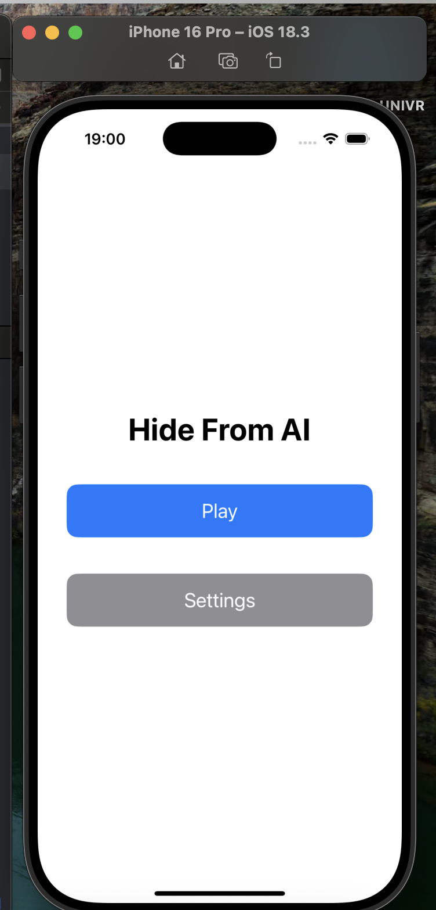
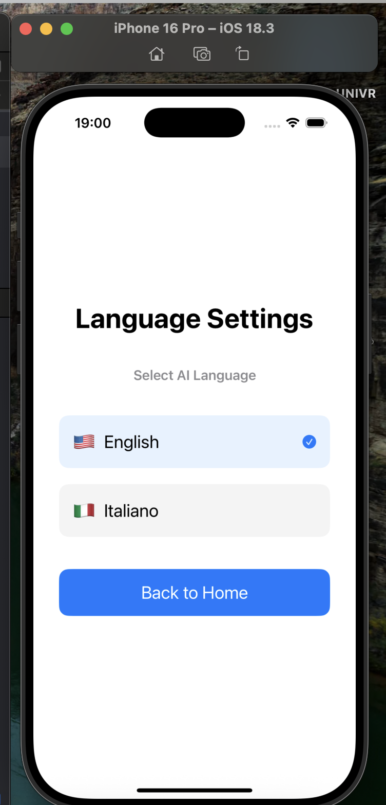
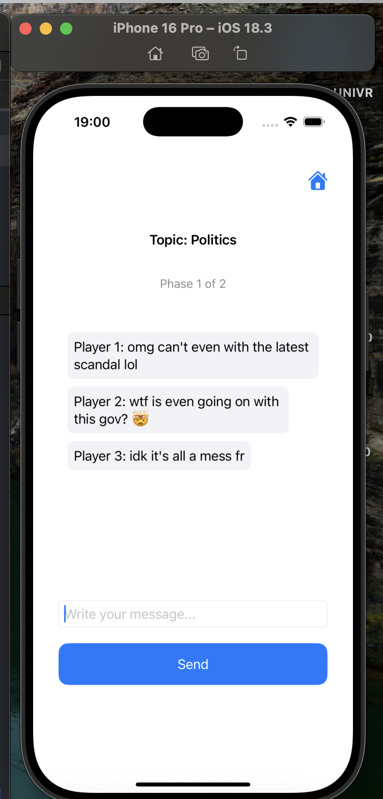
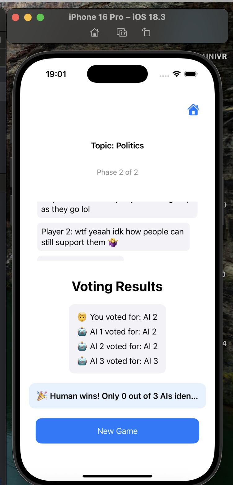

# 🤖 Hide From AI

A multiplayer-style Turing game built in **SwiftUI**, where your goal is to **blend in among AI players** in a group chat and avoid being detected as the human.

## 🧠 Concept

Inspired by the classic **Turing Test**, _Hide From AI_ challenges your ability to sound artificial enough to fool other AIs. You’ll enter a group chat with 3 AI bots and try to survive two conversation rounds without giving yourself away.

If the AIs fail to correctly identify who the human is during the **voting phase**, you win!

## 🛠 Setup

### 1. Configure Your API Key

Before running the app, create your config file:

```bash
cp Config.swift.template Config.swift
```

Edit `Config.swift` and insert your [Groq](https://console.groq.com/) API key:

```swift
struct Config {
    static let groqAPIKey = "your_api_key_here"
}
```

### 2. Build and Run

Open the `.xcodeproj` file in **Xcode**, then run the app on a simulator or real device.

## 🎮 How to Play

1. **Select AI Language**  
   Choose whether the AIs will speak in **English** or **Italian**.
2. **Join the Chat**  
   Enter a group chat with several AI participants. Each AI will always have a different personality, randomly chosen from a pool of available personalities.
3. **Survive 2 Phases of Chat**  
   Try to sound like an AI — don’t give away your humanity!
4. **Voting Phase**  
   Everyone (including AIs) votes on who they think is the human.
5. **Win Condition**  
   You win if none (or few) of the AIs correctly identify you as the human.

## 📸 Screenshots

| Home Screen                                     | Language Settings                                   |
| ----------------------------------------------- | --------------------------------------------------- |
|  |  |

| Chat Phase                                      | Victory!                                       |
| ----------------------------------------------- | ---------------------------------------------- |
|  |  |

## 📋 License

This project is licensed under the **Creative Commons Attribution-NonCommercial 4.0 International (CC BY-NC 4.0)**.  
This means:

- ✅ You can remix, adapt, and build upon the project non-commercially.
- ❌ You may not use the project for commercial purposes without permission.
- 🔗 You must give appropriate credit and indicate if changes were made.

More info: [CC BY-NC 4.0 License](https://creativecommons.org/licenses/by-nc/4.0/)
